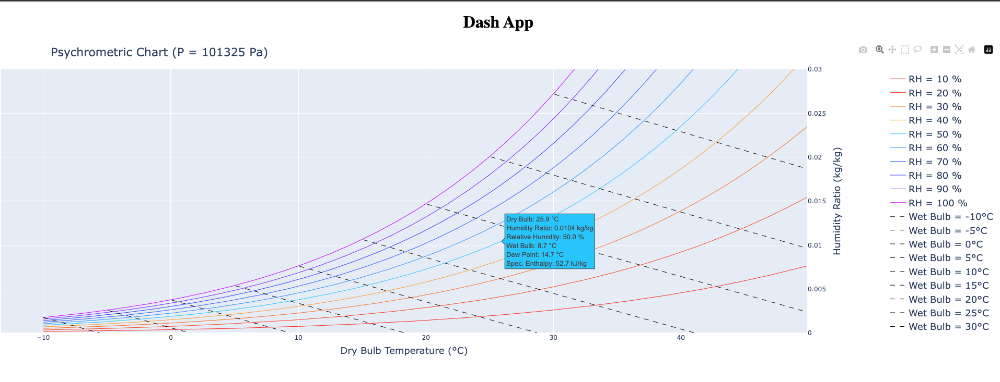

# psychrometry

Psychrometry is the study of thermodynamic properties of gas-vapor mixture.

## Development

We are working on an Interactive App for user to compute thermodynamic changes between two states :)

On-going works

1. Refactor codes (too many duplicated logic now)
2. Annotate the lines instead of legend, to make it more like a psy chart :)
3. Remove the region above 100%, to make it more like a psy chart :)
4. Callback to store thermodynamic states to compute enthalpy change
