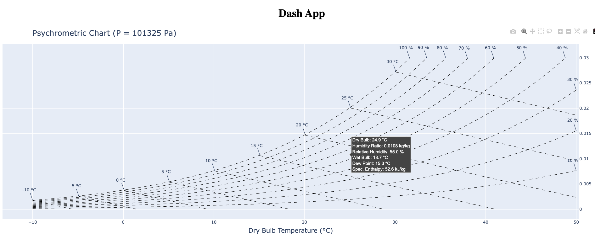

# psychrometry

Psychrometry is the study of thermodynamic properties of gas-vapor mixture.

## Development

We are working on an Interactive App for user to compute thermodynamic changes between two states :)

